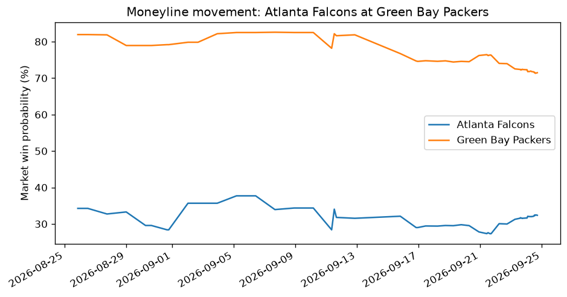

# Betting line movement tracker

Shows how a game's moneyline moved from when books opened it to now, and saves a chart.

Tutorial: [How to track betting line movement](https://www.moneylineapp.com/examples/betting-line-movement-tracker)

## Run it

```bash
pip install -r requirements.txt
export MONEYLINE_API_KEY=your-key
python line_tracker.py --league nfl         # the next NFL game
python line_tracker.py --event <eventId>    # a specific game
```

A run costs 3 credits: 2 to find the next game and 1 for its history.

## Sample output

```
Atlanta Falcons at Green Bay Packers
  Atlanta Falcons              opened   +192 (34%)  now   +209 (32%)  moved -1.9 pts
  Green Bay Packers            opened   -454 (82%)  now   -251 (71%)  moved -10.5 pts
Chart saved to line-movement-nfl-odds-e5fbd3b3953b896b1bf897ddadb3cc4b.png
```



The chart plots the market's average win probability for each team over time. History is recorded from when books first post a game.
